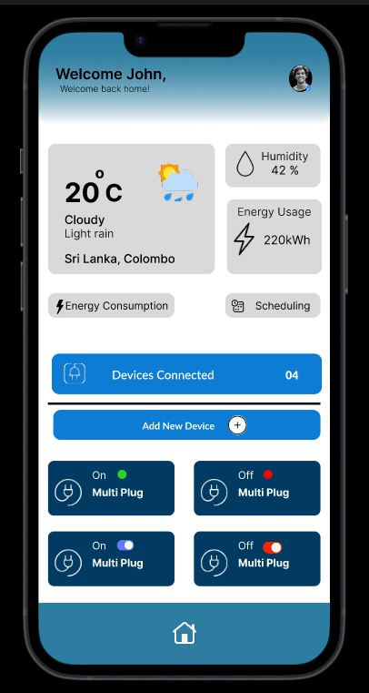
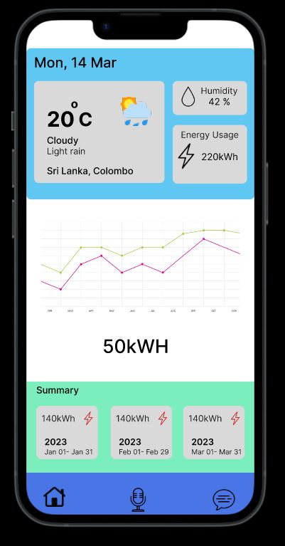

<!DOCTYPE html>
<html lang="en">
<head>
<meta charset="UTF-8">
<meta name="viewport" content="width=device-width, initial-scale=1.0">
</head>
<body>

<h1>Smart Power Adaptor</h1>

<em>Higher Diploma in Software Engineering</em>

<em>Final Project Report (Group 06)</em>

<em>2022.1F</em>

<em>K.S.L. Kuruppu (COHDSE221F015)</em>

<em>Salman Rizwan (COHDSE221F016)</em>

School of Computing and Engineering 
National Institute of Business Management 
Colombo-7

<h2>Table of Contents</h2>
<ol>
  <li><a href="#acknowledgement">Acknowledgement</a></li>
  <li><a href="#abstract">Abstract</a></li>
  <li><a href="#introduction">Introduction</a></li>
  <li><a href="#methodology">Methodology</a></li>
  <li><a href="#features">Features</a></li>
  <li><a href="#screen_design">Screen Designs</a></li>
  <li><a href="#references">References</a></li>
</ol>

<h2 id="acknowledgement">1. Acknowledgement</h2>

We would like to express our sincere gratitude and appreciation to the following individuals who have contributed to the successful completion of this project. We extend our heartfelt thanks to Mr. P.K.S. Asanga, our module lecturer, for their invaluable guidance, expertise, and support throughout the duration of this module...

<h2 id="abstract">2. Abstract</h2>

With the increasing number of electronic devices in our houses and workplaces, there is a need for smart power solutions which can address most of the issues faced by humans when controlling and monitoring their devices...

<h2 id="introduction">3. Introduction</h2>

In today's world, the conversation surrounding energy conservation has become increasingly prevalent. With the looming specter of a global energy crisis within the next few decades, there is a pressing need for innovative solutions to mitigate energy consumption. The Smart Power Adaptor project emerges as a response to this urgent challenge.

At its core, the Smart Power Adaptor is designed to revolutionize the way we interact with our electrical devices. By seamlessly integrating into standard power outlets, it provides users with unparalleled control and insight into their energy usage. This adaptability empowers individuals and businesses alike to make informed decisions regarding their power consumption, ultimately contributing to a more sustainable future.

With its innovative design and multifaceted functionality, the Smart Power Adaptor stands as a beacon of progress in the realm of IoT technology. By bridging the gap between convenience and sustainability, it paves the way for a more efficient and conscientious approach to energy management.

<h2 id="methodology">4. Methodology</h2>

Developing and IOT based solutions is a continuous process of trial and error. Unlike software development like web application or web API development, developers want to work with hardware items specifically electronic devices...

<ul>
  <li>Design and assemble the hardware components, including the ESP 12F Wi-Fi board, 1 Channel relay module, ACS 712 Current Sensor, 220V AC to 5V DC Step Down Transformer, and DS18B20 Temperature Sensor.</li>
  <li>Develop firmware for the ESP 12F Wi-Fi board to enable communication with the mobile app and the Firebase Realtime database.</li>
  <li>Develop a mobile app using Kotlin in Android Studio to enable users to control and monitor the Smart Power Adaptor.</li>
  <li>Integrate a machine learning model using TensorFlow for voice recognition functionality to enable users to control the device via voice commands.</li>
  <li>Test the hardware and software components individually and then integrate them to ensure seamless functionality of the entire system.</li>
  <li>Launch the product and continue to gather errors and bugs to inform future product improvements and updates.</li>
</ul>

<h2 id="features">5. Features</h2>
<ol>
  <li>Can control connected devices using a mobile phone from any location.</li>
  <li>Monitor power consumption details of the connected device.</li>
  <li>Scheduled On Off feature to connected devices.</li>
  <li>Detection of hazardous environment around the device and stopped automatically.</li>
</ol>

<h2 id="screen_design">6. Screen Designs</h2>

<h2 id="references">References</h2>
<ol>
  <li>RandomNerdTutorials (2023) ESP8266 NodeMCU NTP Client-Server: Get Date and Time (Arduino IDE)</li>
  <li>Markerguides (2022) ACS712 Current Sensor And Arduino – A Complete Guide</li>
  <li>EngineersGarage (2023) How to measure current using Arduino and ACS712 current sensor</li>
  <li>Marderguides (2022) How to use DHT11 and DHT22 Sensors with Arduino</li>
  <li>Joedgoh. (2022) Realtime READ AND Write with Firebase + ESP32 + Android Studio – IOT Development</li>
</ol>

</body>
</html>
